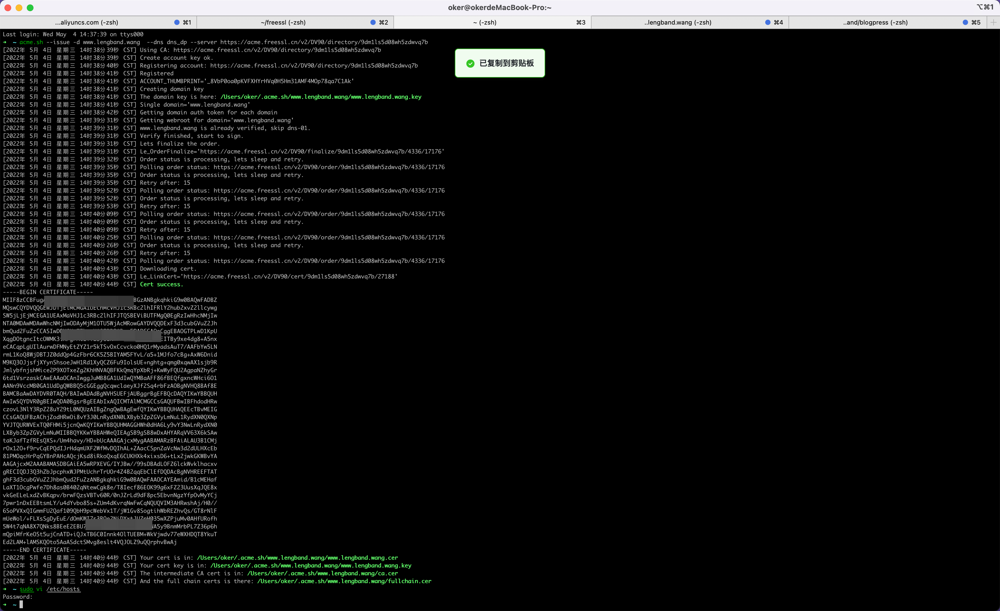

# 域名申请免费证书
1. 申请域名：lengband.wang
1. 为域名申请免费证书，注册登录 https://freessl.cn/
2. 点击 创建免费的SSL证书

3. ACME 域名配置（参考：https://blog.freessl.cn/acme-quick-start/）
4. 执行脚本后如下图，cert和key在下面地址，可以直接用在nginx等服务器中

4. 配置成功的会显示在这里

5. 本地可以通过配置/etc/hosts的方式验证
`127.0.0.1 www.lengband.wang`
1. 以nginx服务器为例，配置ssl_certificate 和 ssl_certificate_key，启动 nginx
    ```sh
    ssl_certificate      /Users/oker/.acme.sh/www.lengband.wang/www.lengband.wang.cer;
    ssl_certificate_key  /Users/oker/.acme.sh/www.lengband.wang/www.lengband.wang.key;
    ```
1. 验收效果


